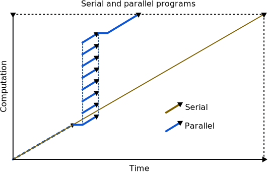
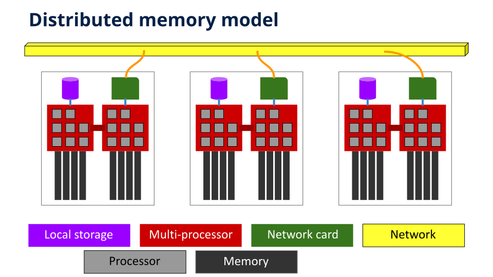
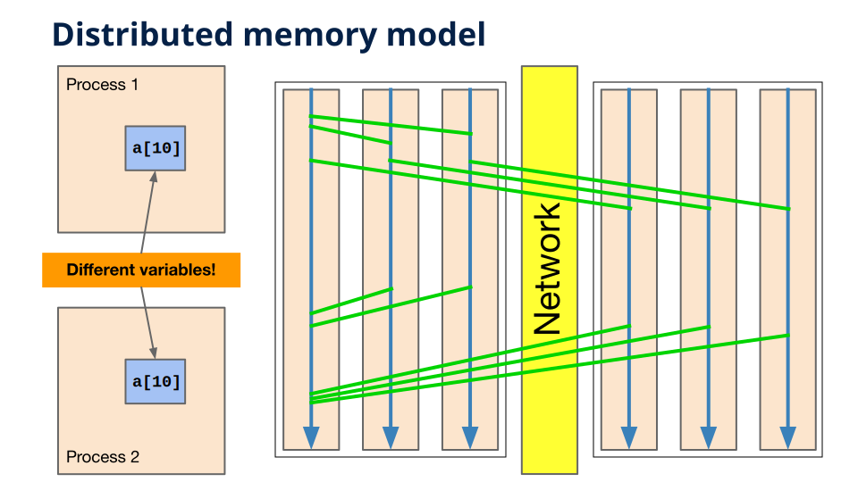

Introduction
============

`Français <../fr/1-introduction.html>`_

There are two main categories of programs for solving a problem: serial
programs and parallel programs.

Modern supercomputers consist of a **large number of compute servers**, each
containing **several processors** that must **coordinate** to run a parallel
program.

.. figure:: https://live.staticflickr.com/65535/49019703558_3c49a9766e.jpg

MPI is the most **common and portable** method of parallelizing a program
running on multiple servers.

Distributed memory machine
--------------------------

A distributed memory machine consists of several compute servers, commonly
called *nodes*, which are connected via a high-performance network. The memory
is said to be *distributed* because programs on one server cannot directly
access the memory on another server.

In this type of machine, seemingly identical variables are in fact **completely
different instances in different processes**. Therefore, it becomes necessary
to establish a means of communication between processes to **transfer data**.

Questions to ask yourself
-------------------------

- Why split a calculation across multiple servers?

  - To possibly speed it up.
  - To potentially increase the size of the calculation and obtain a result in
    a reasonable time.
  - Due to the limited amount of RAM on each server.

- What strategy should be used to divide a calculation?

  - We will see this in the next section.

- How to send and receive data between processes?

  - This is what we will see in the following chapters.

Calculation division strategies
-------------------------------

The division or partitioning of a calculation can be done according to the
space of iterations or according to the space of the model to be calculated.

.. _intro-linear-spaces:

Linear spaces
'''''''''''''

- In the case of :math:`N` values calculated successively, the calculation of a
  reduction of these values, for example a sum or a product, can be divided
  equally among the processes. Then, the result of each *local* reduction is
  used to calculate the overall reduction. For example, one could calculate a
  reduction of :math:`N=12` values with a reduction operator ``op`` (``+`` for
  a sum, ``*`` for a product) using three processes (p0, p1, and p2).

  .. figure:: ../images/parallel-reduction_en.svg

- In the case of a calculation that uses data from a vector or that generates
  data to be stored in a vector, the operations can be divided equally between
  processes, but it must be kept in mind that optimizations depend on the
  proximity of the data in memory.

  .. figure:: ../images/parallel-array-1d_en.svg

.. _intro-two-dim-spaces:

Two-dimensional spaces
''''''''''''''''''''''

- In the case of a calculation using data arranged in two dimensions, such as
  matrices or images, the space can be divided into horizontal partitions,
  vertical partitions, or blocks. For example, an 8x8 matrix could be divided
  into four similar partitions, and a process would be assigned to each
  partition.

  .. figure:: ../images/parallel-array-2d.svg

- In the case of a calculation using data from a linear space, for example a
  vector, but which calculates all the different pairs of values, we end up
  with a two-dimensional computation space and, therefore, with the same
  partitioning options as in the figure above.

  .. figure:: ../images/parallel-comb-1dx1d.svg

Manager-worker model
''''''''''''''''''''

- In the case of a problem with a list of non-uniform computations, we would
  like to be able to distribute one computation at a time to each available
  process. This parallel computing model includes:

  - A manager, usually the first process in a group. Its responsibilities
    include:

    - Distribute calculations and receive results from workers.
    - Send a special message when it is time to *leave* (exit).

  - Workers, or the remaining processes within the group. Their
    responsibilities are:

    - Receive a calculation to perform and send the results to the manager.
    - Exit when the manager sends a message to that effect.

  .. figure:: ../images/parallel-manager-workers_en.svg

In short, all these strategies involve **sending and receiving messages**.
