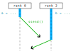
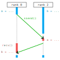
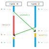

Point-to-point communications
=============================

`Français <../fr/3-point-a-point.html>`_

- Point-to-point communications are *local*, which means that only **two
  processes** are involved: they are the only ones that call reciprocal
  communication functions and are the only ones involved in the exchange.

  - Send and receive functions are always called in pairs by different
    processes.

- Send and receive functions can be blocking or non-blocking.

Sending and receiving (blocking)
--------------------------------

With ``mpi4py``, data transmissions are made from a communicator (``comm``) and
the ``send()`` `method
<https://mpi4py.readthedocs.io/en/stable/reference/mpi4py.MPI.Comm.html#mpi4py.MPI.Comm.send>`__:

.. code-block:: python

    comm.send(obj, dest=dest, tag=tag)

- ``comm``: for example, ``MPI.COMM_WORLD``.
- ``obj``: any object that can be serialized via `pickle
  <https://docs.python.org/3/library/pickle.html#module-pickle>`__.
- ``dest``: rank of receiving process (destination).
- ``tag``: user-defined number (can be used to check reception).

Reciprocally, data reception occurs from the same communicator and the
``recv()`` `method
<https://mpi4py.readthedocs.io/en/stable/reference/mpi4py.MPI.Comm.html#mpi4py.MPI.Comm.recv>`__:

.. code-block:: python

    data = comm.recv(source=source, tag=tag, status=status)

- ``data``: a variable or part of a modifiable object, to receive the
  deserialized object.
- ``source``: ``MPI.ANY_SOURCE`` (default value) or the rank of a specific
  sender.
- ``tag``: ``MPI.ANY_TAG`` (default value) or a specific tag.
- ``status``: ``None`` (default value) or an object of type ``MPI.Status``.

  - ``.count``: number of bytes received.
  - ``.source``: rank of the source of the received message.
  - ``.tag``: tag of the received message.

Example - Sending and receiving
'''''''''''''''''''''''''''''''

Each process has its own variables ``a`` and ``b``. Process 2 sends the value
of its variable ``a`` to process 0, which receives this value in its variable
``b``.

With ``mpi4py``, here is an implementation of this communication:

.. code-block:: python

    if rank == 2:
        comm.send(a, dest=0, tag=746)
    elif rank == 0:
        b = comm.recv(source=2, tag=746)

Exercise #2 - Sending a matrix
''''''''''''''''''''''''''''''

**Objective**: sending a 4x4 matrix from process 0 to process 1.

**Instructions**

#. Go to the exercise directory with
   ``cd ~/mpi201-main/lab/send_matrix``.
#. Edit `the file
   <https://github.com/calculquebec/mpi201/blob/main/lab/send_matrix/send_matrix.py>`__
   ``send_matrix.py`` to program the matrix transfer.
#. Run this program with two (2) processes.

Avoiding deadlock situations
----------------------------

Consider the following code:

.. code-block:: python
    :emphasize-lines: 2,5

    if rank == 0:
        comm.ssend(a, dest=2, tag=10)
        b = comm.recv(source=2, tag=11)
    elif rank == 2:
        comm.ssend(b, dest=0, tag=11)
        a = comm.recv(source=0, tag=10)

- The `synchronous method
  <https://mpi4py.readthedocs.io/en/stable/reference/mpi4py.MPI.Comm.html#mpi4py.MPI.Comm.ssend>`__
  ``ssend()`` is a version of ``send()`` without a buffer, which makes it
  always blocking (``send()`` may not block for small messages).
- In the above case, the two processes wait until the other calls ``recv()``.
  This code is hence **buggy** and causes a deadlock!
- And even with ``send()`` instead of ``ssend()``, the code is risky. The
  amount of buffer memory for ``send()`` is not defined, so the code may
  eventually block when exchanging large messages.

Solution 1
''''''''''

Change the order of calls to ``ssend()`` and ``recv()`` for one of the two
processes. For example:

.. code-block:: python
    :emphasize-lines: 5-6

    if rank == 0:
        comm.ssend(a, dest=2, tag=10)
        b = comm.recv(source=2, tag=11)
    elif rank == 2:
        a = comm.recv(source=0, tag=10)
        comm.ssend(b, dest=0, tag=11)

One can generalize this technique to more processes:

- Evenly ranked processes start by sending.
- Oddly ranked processes start by receiving.

Exercise #3 - Exchange two lists
''''''''''''''''''''''''''''''''

**Objective**: exchange a small list with data.

**Instructions**

#. Go to the exercise directory with
   ``cd ~/mpi201-main/lab/exchange``.
#. Edit `the file
   <https://github.com/calculquebec/mpi201/blob/main/lab/exchange/exchange.py>`__
   ``exchange.py`` to program the data exchange.
#. Run this program with two (2) processes.

Solution 2
''''''''''

Non-blocking communications are used to initiate the transfers. Even when the
send hasn't finished yet, each process can start the receive, so deadlocks are
avoided. For example:

.. code-block:: python
    :emphasize-lines: 2,5,8

    if rank == 0:
        request = comm.isend(a, dest=2, tag=10)
        b = comm.recv(source=2, tag=11)
    elif rank == 2:
        request = comm.isend(b, dest=0, tag=11)
        a = comm.recv(source=0, tag=10)

    request.wait()

In addition to unblocking both processes, this solution allows calculations to
resume more quickly.

Non-blocking communications
---------------------------

With ``mpi4py``, the communicators have the following `methods
<https://mpi4py.readthedocs.io/en/stable/reference/mpi4py.MPI.Comm.html>`__:

.. code-block:: python
    :emphasize-lines: 1,4

    request = comm.isend(obj, dest, tag=0)
    request.wait()

    request = comm.irecv(source=ANY_SOURCE, tag=ANY_TAG)
    data = request.wait(status=None)

- You don’t need to make both send and receive non-blocking (all combinations
  are permitted).
- After calling ``isend()`` or ``irecv()``, one must use the ``request`` object
  returned by the call to ensure that the communication has terminated.

  - The ``wait()`` `method
    <https://mpi4py.readthedocs.io/en/stable/reference/mpi4py.MPI.Request.html#mpi4py.MPI.Request.wait>`__
    is blocking. When it returns, the communication has finished.
  - During a reception, it is ``request.wait()`` which returns the received
    data in a deserialized object.

- Only once the communication has finished one can reuse the arrays that were
  sent or received!

Here is an example of an iterative calculation on an array ``a[]`` where each
process ``rank`` is responsible for the values at indices from ``start`` to
``end - 1`` (we will see later how to calculate ``start`` and ``end``).
However, at each iteration, there must be an exchange of values at both
boundaries:

.. code-block:: python
    :emphasize-lines: 6,9,13,14,18

    req_irecv_start_1 = comm.irecv(source=rank - 1, tag=ANY_TAG)
    req_isend_start = comm.isend(a[start], dest=rank - 1, tag=0)
    req_isend_end_1 = comm.isend(a[end - 1], dest=rank + 1, tag=0)
    req_irecv_end = comm.irecv(source=rank + 1, tag=ANY_TAG)

    for iteration in range(1000):
        a[start - 1] = req_irecv_start_1.wait(status=None)
        req_isend_start.wait()
        a[start] = f(a[start - 1], a[start], a[start + 1])
        req_irecv_start_1 = comm.irecv(source=rank - 1, tag=ANY_TAG)
        req_isend_start = comm.isend(a[start], dest=rank - 1, tag=0)

        for i in range(start + 1, end - 1):  # start + 1 ... end - 2
            a[i] = f(a[i - 1], a[i], a[i + 1])

        req_isend_end_1.wait()
        a[end] = req_irecv_end.wait(status=None)
        a[end - 1] = f(a[end - 2], a[end - 1], a[end])
        req_isend_end_1 = comm.isend(a[end - 1], dest=rank + 1, tag=0)
        req_irecv_end = comm.irecv(source=rank + 1, tag=ANY_TAG)

    a[start - 1] = req_irecv_start_1.wait(status=None)
    req_isend_start.wait()
    req_isend_end_1.wait()
    a[end] = req_irecv_end.wait(status=None)

The use of non-blocking communications allows different operations to be
performed during these numerous communications, which reduces the impact of
communications on the efficiency of parallel computing.
