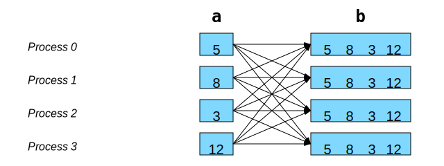
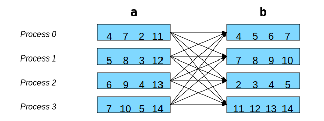

Appendix
========

`Français <../fr/8-annexes.html>`_

Other collective communications
-------------------------------

Gather to all with ``allgather``
''''''''''''''''''''''''''''''''

It is the equivalent of ``gather`` + ``bcast``, but `more efficient
<https://mpi4py.readthedocs.io/en/stable/reference/mpi4py.MPI.Comm.html#mpi4py.MPI.Comm.allgather>`__:

With ``mpi4py``, the code would be:

.. code-block:: python

    # allgather(obj: Any) -> list[Any]

    b = comm.allgather(a)

Global transposition with ``alltoall``
''''''''''''''''''''''''''''''''''''''

It is the equivalent of ``scatter`` * ``gather``, but `more efficient
<https://mpi4py.readthedocs.io/en/stable/reference/mpi4py.MPI.Comm.html#mpi4py.MPI.Comm.alltoall>`__:

With ``mpi4py``, the code would be:

.. code-block:: python

    # alltoall(sequence_obj: Sequence[Any]) -> list[Any]

    b = comm.alltoall(a)

Measuring elapsed time with ``MPI.Wtime()``
-------------------------------------------

To precisely measure the execution time of a section of code, you can use the
``MPI.Wtime()`` function, which returns a double-precision time value in
seconds. To calculate the elapsed time, simply call the function twice and
calculate the difference between the returned values. Typically, a single
process performs this calculation.

.. code-block:: python

    if rank == 0:
        t1 = MPI.Wtime()

    # Parallel computing and communications

    if rank == 0:
        t2 = MPI.Wtime()
        print(f'Elapsed time = {t2 - t1:.6f} sec')

Advanced concepts
-----------------

The ``mpi4py`` library has other interesting features for optimizing
communications and for adapting to problems where the computational
portions are unequal.

Communications with NumPy arrays
''''''''''''''''''''''''''''''''

In the workshop chapters, the communication functions used relied on
serializing and reconstructing objects via the ``pickle`` `module
<https://docs.python.org/3/library/pickle.html#module-pickle>`__ to transfer
data. However, for sending NumPy arrays, this serialization step is
unnecessarily lengthy, as the data is already uniform and lacks complex
structures. Furthermore, MPI is already designed to transfer standard data
arrays (integers or floating-point numbers). So, how can we leverage this?

To enable more efficient communications with NumPy arrays, the ``mpi4py``
library provides several methods equivalent to those we have seen, except that
their names begin with a capital letter:

- `MPI.Comm.Send
  <https://mpi4py.readthedocs.io/en/stable/reference/mpi4py.MPI.Comm.html#mpi4py.MPI.Comm.Send>`__,
  `MPI.Comm.Recv
  <https://mpi4py.readthedocs.io/en/stable/reference/mpi4py.MPI.Comm.html#mpi4py.MPI.Comm.Recv>`__
- `MPI.Comm.Isend
  <https://mpi4py.readthedocs.io/en/stable/reference/mpi4py.MPI.Comm.html#mpi4py.MPI.Comm.Isend>`__,
  `MPI.Comm.Irecv
  <https://mpi4py.readthedocs.io/en/stable/reference/mpi4py.MPI.Comm.html#mpi4py.MPI.Comm.Irecv>`__
- `MPI.Comm.Bcast
  <https://mpi4py.readthedocs.io/en/stable/reference/mpi4py.MPI.Comm.html#mpi4py.MPI.Comm.Bcast>`__,
  `MPI.Comm.Scatter
  <https://mpi4py.readthedocs.io/en/stable/reference/mpi4py.MPI.Comm.html#mpi4py.MPI.Comm.Scatter>`__,
  `MPI.Comm.Gather
  <https://mpi4py.readthedocs.io/en/stable/reference/mpi4py.MPI.Comm.html#mpi4py.MPI.Comm.Gather>`__

Here is a code snippet adapted from the `Broadcasting a NumPy array
<https://mpi4py.readthedocs.io/en/stable/tutorial.html#collective-communication>`__
example:

.. code-block:: python

    if rank == 0:
        my_array = np.arange(1000, dtype='i')
    else:
        my_array = np.empty(1000, dtype='i')

    # Process 0 sends its my_array to the others
    comm.Bcast(my_array, 0)

Note that the receiving array must be constructed beforehand before calling the
``Bcast()`` method.

For more examples, see the `complete tutorial
<https://mpi4py.readthedocs.io/en/stable/tutorial.html>`__.

Collective communications with unequal portions
'''''''''''''''''''''''''''''''''''''''''''''''

The collective communication functions seen so far sent the same number of
elements for each MPI process. With ``mpi4py``, NumPy arrays can be split or
rebuilt with a different number of values for each process:

- The two main methods are: `MPI.Comm.Scatterv
  <https://mpi4py.readthedocs.io/en/stable/reference/mpi4py.MPI.Comm.html#mpi4py.MPI.Comm.Scatterv>`__
  and `MPI.Comm.Gatherv
  <https://mpi4py.readthedocs.io/en/stable/reference/mpi4py.MPI.Comm.html#mpi4py.MPI.Comm.Gatherv>`__.
- These methods do not automatically account for the internal storage of NumPy
  arrays; they assume a contiguous sequence of data in memory. Therefore, the
  internal storage of the NumPy array must be planned: in *C* mode, the values
  of a 2D matrix are stored row by row, while in *Fortran* mode they are stored
  column by column.

  - For more information, see `strides
    <https://numpy.org/doc/stable/reference/generated/numpy.ndarray.strides.html>`__
    and the ``order`` `parameter
    <https://numpy.org/doc/stable/reference/generated/numpy.ndarray.html>`__.

- See also `the examples
  <https://github.com/calculquebec/mpi201/tree/main/lab/scatterv>`__
  in ``~/mpi201-main/lab/scatterv``.

MPI in other programming languages
----------------------------------

- C and Fortran: the MPI standard is already defined in these languages.
- C++:

  - MPI 3.0 has eliminated C++ bindings.
  - `Boost MPI <https://www.boost.org/doc/libs/release/libs/mpi/>`__:
    a practical and very powerful library for C++ developers.
  - `Boost-MPI lunchtime conference
    <https://www.youtube.com/watch?v=U0axIKTO3wM>`__ (in French).

  .. code-block:: c++

      boost::mpi::environment env(argc, argv);
      boost::mpi::communicator world;
      std::string s;

      if (world.rank() == 0)
          world.recv(boost::mpi::any_source, 746, s);

Additional parallelization challenges
-------------------------------------

The following codes already work in sequential mode.
Now it's up to you to parallelize them with MPI:

- `Convolution on an image
  <https://github.com/calculquebec/cq-formation-convolution/tree/main/defi-mpi>`__
- `Heat flow
  <https://github.com/calculquebec/cq-formation-ecoulement-chaleur>`__
- `N-body problem
  <https://github.com/calculquebec/cq-formation-nbody>`__

To measure the execution time of a program, the ``time srun`` command must be
in a `job script <https://docs.alliancecan.ca/wiki/Running_jobs#MPI_job>`__
submitted with the ``sbatch`` command:

.. code-block:: bash

    #!/bin/bash
    #SBATCH --ntasks=4
    #SBATCH … # time, memory, etc.

    time srun ./program
