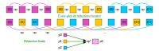

Communications collectives
==========================

`English <../en/collectives.html>`_

Les communications collectives peuvent faire :

- Des **déplacements de données**.

  - ``comm.bcast()``
  - ``comm.scatter()``
  - ``comm.gather()``, ``comm.allgather()``
  - ``comm.alltoall()``

- Des **calculs collectifs**.

  - ``comm.reduce()``, ``comm.allreduce()``

Chaque appel à ces méthodes doit être fait par **tous les processus d’un même
communicateur**.

Déplacements de données
-----------------------

Diffusion de données avec ``bcast``
'''''''''''''''''''''''''''''''''''

Pour envoyer les mêmes informations à tous les processus d’un même
communicateur, on utilise une `méthode
<https://mpi4py.readthedocs.io/en/stable/reference/mpi4py.MPI.Comm.html#mpi4py.MPI.Comm.bcast>`__
effectuant une **diffusion** :

.. figure:: ../images/mpi_bcast_fr.svg

Avec ``mpi4py``, on aurait le code suivant :

.. code-block:: python

    if rank == 2:
        a = 3
    else:
        a = None

    # bcast(objet: Any, racine: int = 0) -> Any

    a = comm.bcast(a, 2)

Distribution de données avec ``scatter``
''''''''''''''''''''''''''''''''''''''''

Pour envoyer une portion des données à chaque processus d’un même
communicateur, on utilise une `méthode
<https://mpi4py.readthedocs.io/en/stable/reference/mpi4py.MPI.Comm.html#mpi4py.MPI.Comm.scatter>`__
effectuant une **distribution** :

.. figure:: ../images/mpi_scatter_fr.svg

Avec ``mpi4py``, on aurait le code suivant :

.. code-block:: python

    if rank == 2:
        a = [5, 8, 3, 12]
    else:
        a = None

    # scatter(envoi: Sequence[Any] | None, racine: int = 0) -> Any

    b = comm.scatter(a, 2)

Regroupement de données avec ``gather``
'''''''''''''''''''''''''''''''''''''''

Pour récupérer plusieurs portions de données dans un seul processus d’un
communicateur, on utilise une `méthode
<https://mpi4py.readthedocs.io/en/stable/reference/mpi4py.MPI.Comm.html#mpi4py.MPI.Comm.gather>`__
effectuant un **regroupement** :

.. figure:: ../images/mpi_gather_fr.svg

Avec ``mpi4py``, on aurait le code suivant :

.. code-block:: python

    # gather(envoi: Any, racine: int = 0) -> list[Any] | None

    b = comm.gather(a, 2)

    if rank == 2:
        for valeur in b:
            print(valeur)

Regroupement à tous avec ``allgather``
''''''''''''''''''''''''''''''''''''''

C’est l’équivalent de ``gather`` + ``bcast``, mais en `plus efficace
<https://mpi4py.readthedocs.io/en/stable/reference/mpi4py.MPI.Comm.html#mpi4py.MPI.Comm.allgather>`__ :

.. figure:: ../images/mpi_allgather_fr.svg

Avec ``mpi4py``, on aurait le code suivant :

.. code-block:: python

    # allgather(envoi: Any) -> list[Any]

    b = comm.allgather(a)

Transposition globale avec ``alltoall``
'''''''''''''''''''''''''''''''''''''''

C’est l’équivalent de ``scatter`` * ``gather``, mais en `plus efficace
<https://mpi4py.readthedocs.io/en/stable/reference/mpi4py.MPI.Comm.html#mpi4py.MPI.Comm.alltoall>`__ :

.. figure:: ../images/mpi_alltoall_fr.svg

Avec ``mpi4py``, on aurait le code suivant :

.. code-block:: python

    # alltoall(envoi: Sequence[Any]) -> list[Any]

    b = comm.alltoall(a)

Division de l’espace de travail
'''''''''''''''''''''''''''''''

Avant de se lancer avec un exercice, revoyons comment diviser l’espace de
travail. On se rappelle cette figure vue en
:ref:`introduction <intro-espaces-deux-dimensions>` :

.. figure:: ../images/parallel-array-2d.svg

Une première stratégie consiste à diviser l’espace de travail en portions plus
ou moins égales **selon une dimension**.

- Or, puisque la taille ``N`` d’une dimension n’est pas nécessairement un
  multiple entier de ``nranks``, on ne peut pas faire une division entière de
  ``N`` par ``nranks`` pour définir une taille unique de portion. On risquerait
  alors d’oublier des éléments à calculer.
- Par contre, on peut utiliser ``rank`` et ``rank + 1`` dans le calcul des
  bornes inférieure et supérieure d’une portion de calcul. Dans l’exemple
  ci-dessous, la borne supérieure ``fin`` du processus ``rank`` correspond à
  la borne inférieure ``debut`` du processus ``rank + 1``, donc aucune
  itération n’est perdue :

  .. code-block:: python

      # Si rank vaut 0 (le premier rang), debut vaut 0
      debut = rank * N // nranks

      # Si rank vaut nranks-1 (le dernier rang), fin vaut N
      fin = (rank + 1) * N // nranks

      # Différentes sélections
      portion_h = matrice[debut:fin, :]  # Quelques lignes
      portion_v = matrice[:, debut:fin]  # Quelques colonnes

Exercice #4 - Multiplication de matrices
''''''''''''''''''''''''''''''''''''''''

**Objectif** : partager le calcul d’une multiplication de matrices.

Étant donné que `le produit matriciel
<https://fr.wikipedia.org/wiki/Produit_matriciel>`__ :math:`A \times B = C`
peut se calculer colonne par colonne, chaque processus aura la même matrice
:math:`A` et une portion unique de la matrice :math:`B`, soit un bloc de
quelques colonnes consécutives de :math:`B`. Les produits partiels seront
ensuite concaténés horizontalement pour former la matrice résultante :math:`C`.

.. figure:: ../images/parallel-mat-mul.svg

**Instructions**

#. Allez dans le répertoire de l’exercice avec la commande
   ``cd ~/mpi201-main/lab/mat_mul``.
#. Dans le fichier ``mat_mul.py``, éditez les lignes avec des ``...``.
   Essentiellement, le processus racine :

   #. Crée la matrice ``A`` et **diffuse** cette matrice aux autres processus.
   #. Crée des portions plus ou moins égales de ``B`` dans ``b_list`` et
      **distribue** une portion à chaque processus.
   #. **Regroupe** les multiplications partielles dans ``c_list`` et génère la
      matrice résultante ``C``.

#. Chargez un module ``scipy-stack`` pour avoir accès à NumPy.
#. Lancez le programme avec deux (2), trois (3) et quatre (4) processus.

Calculs collectifs
------------------

Opérations de réduction
'''''''''''''''''''''''

C’est l’équivalent d’un ``gather`` avec une boucle effectuant une opération de
réduction. Voici quelques opérations de réduction :

.. list-table:: Opérateurs de réduction
    :header-rows: 1

    * - Opération
      - Opérateur de type ``MPI.Op``
      - Op([3, 5])
    * - `Maximum
        <https://mpi4py.readthedocs.io/en/stable/reference/mpi4py.MPI.MAX.html>`__
      - ``MPI.MAX``
      - 5
    * - `Minimum
        <https://mpi4py.readthedocs.io/en/stable/reference/mpi4py.MPI.MIN.html>`__
      - ``MPI.MIN``
      - 3
    * - `Somme
        <https://mpi4py.readthedocs.io/en/stable/reference/mpi4py.MPI.SUM.html>`__
      - ``MPI.SUM``
      - 8
    * - `Produit
        <https://mpi4py.readthedocs.io/en/stable/reference/mpi4py.MPI.PROD.html>`__
      - ``MPI.PROD``
      - 15
    * - `ET logique
        <https://mpi4py.readthedocs.io/en/stable/reference/mpi4py.MPI.LAND.html>`__
      - ``MPI.LAND``
      - Vrai
    * - `OU logique
        <https://mpi4py.readthedocs.io/en/stable/reference/mpi4py.MPI.LOR.html>`__
      - ``MPI.LOR``
      - Vrai
    * - `OU exclusif logique
        <https://mpi4py.readthedocs.io/en/stable/reference/mpi4py.MPI.LXOR.html>`__
      - ``MPI.LXOR``
      - Faux
    * - `ET binaire
        <https://mpi4py.readthedocs.io/en/stable/reference/mpi4py.MPI.BAND.html>`__
      - ``MPI.BAND``
      - 1 (011 & 101 = 001)
    * - `OU binaire
        <https://mpi4py.readthedocs.io/en/stable/reference/mpi4py.MPI.BOR.html>`__
      - ``MPI.BOR``
      - 7 (011 | 101 = 111)
    * - `OU exclusif binaire
        <https://mpi4py.readthedocs.io/en/stable/reference/mpi4py.MPI.BXOR.html>`__
      - ``MPI.BXOR``
      - 6 (011 ^ 101 = 110)

Réduction avec ``reduce``
'''''''''''''''''''''''''

Voici un exemple de `réduction
<https://mpi4py.readthedocs.io/en/stable/reference/mpi4py.MPI.Comm.html#mpi4py.MPI.Comm.reduce>`__
effectuant une somme :

.. figure:: ../images/mpi_reduce_fr.svg

Avec ``mpi4py``, on aurait le code suivant :

.. code-block:: python

    # reduce(envoi: Any, op: Op=SUM, racine: int = 0) -> Any | None

    b = comm.reduce(a, MPI.SUM, 2)

Réduction et diffusion avec ``allreduce``
'''''''''''''''''''''''''''''''''''''''''

C’est l’équivalent de ``reduce`` + ``bcast``, mais en `plus efficace
<https://mpi4py.readthedocs.io/en/stable/reference/mpi4py.MPI.Comm.html#mpi4py.MPI.Comm.allreduce>`__ :

.. figure:: ../images/mpi_allreduce_fr.svg

Avec ``mpi4py``, on aurait le code suivant :

.. code-block:: python

    # allreduce(envoi: Any, op: Op=SUM) -> Any

    b = comm.allreduce(a, MPI.SUM)

Division de l’espace de calcul
''''''''''''''''''''''''''''''

On se rappelle cette figure vue en :ref:`introduction <intro-espaces-lineaires>` :

- La stratégie qui consiste à diviser l’espace de calcul en portions plus
  ou moins égales fonctionne encore.

  .. code-block:: python

      borne_inf = rank * N // nranks        # borne inférieure
      borne_sup = (rank + 1) * N // nranks  # borne supérieure

      # Boucle dans l'intervalle : borne_inf <= k < borne_sup
      for k in range(borne_inf, borne_sup):
          ...

- Une seconde stratégie consiste à définir une boucle qui débute à ``rank``,
  effectue des sauts de ``nranks`` et itère jusqu’à la fin de l’espace de
  calcul. Ainsi, chaque processus débute la boucle à un indice différent.

  .. code-block:: python

      for k in range(rank, N, nranks):
          ...

Selon le calcul effectué, il se pourrait que l’une de ces deux stratégies donne
un résultat numérique plus stable.

Exercice #5 - Approximation de :math:`\pi`
''''''''''''''''''''''''''''''''''''''''''

**Objectif** : diviser le calcul d’une longue série approximant la constante
:math:`\pi`.

Étant donné :

.. math::

    \pi = 4 \times \frac{\pi}{4} = 4 \times \arctan(1)

Et étant donné `la série de Taylor
<https://fr.wikipedia.org/wiki/S%C3%A9rie_de_Taylor>`__ :

.. math::

    \arctan(1) = \sum_{k=0}^{\infty} \frac{(-1)^k}{2k + 1}

Il est donc possible d'approximer :math:`\pi` au moyen de :math:`N` termes :

.. math::

    \pi \approx 4 \times \sum_{k=0}^{N - 1} \frac{(-1)^k}{2k + 1}

Avec :

.. math::

    4 \times (-1)^k & = & \: 4 \times (1 - 2 \times (k \bmod 2)) \\\\
                    & = & \: 4 - 8 \times (k \bmod 2)

Numériquement, l’accumulation des termes doit se faire dans l’ordre inverse,
c’est-à-dire en commençant par le plus petit des termes, donc avec l’indice
:math:`k=N-1`. Cela permet d’accumuler avec précision les plus petits termes
tout en minimisant l’accumulation d’erreurs dans les bits les moins
significatifs du résultat final.

**Instructions**

#. Allez dans le répertoire de l’exercice avec la commande
   ``cd ~/mpi201-main/lab/pi``.
#. Dans le fichier ``pi-sauts.py``, complétez la conversion du programme sériel
   en programme utilisant MPI.

   #. Utilisez la stratégie qui consiste à **faire des sauts** de ``nranks``
      dans une boucle débutant à une valeur de ``k`` qui dépend de ``rank``.
   #. Programmez une réduction des ``somme`` dans la variable ``pi``.
   #. Lancez le programme avec deux (2), trois (3) et quatre (4) processus et
      observez la précision de l’approximation de pi.

#. Dans le fichier ``pi-blocs.py``, complétez la conversion du programme sériel
   en programme utilisant MPI.

   #. Utilisez la stratégie qui consiste à **boucler d’une borne supérieure à
      une borne inférieure**.
   #. Programmez une réduction des ``somme`` dans la variable ``pi``.
   #. Lancez le programme avec deux (2), trois (3) et quatre (4) processus et
      observez la précision de l’approximation de pi.

#. Éditez à nouveau ``pi-blocs.py`` de sorte à mesurer le temps du calcul
   parallèle. Voici un exemple où seul le processus racine mesure le temps
   écoulé :

   .. code-block:: python

      if rank == 0:
          t1 = MPI.Wtime()

      # Calcul parallèle et communications

      if rank == 0:
          t2 = MPI.Wtime()
          print(f'Temps = {t2 - t1:.6f} sec')

   #. Lancez le programme avec deux (2), quatre (4) et huit (8) processus et
      observez le temps de calcul mesuré.
